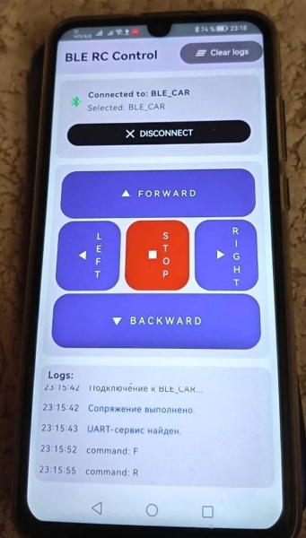

## BLE Robot Car Control
...........

### Назначение

Данная работа представляет собой учебный проект по созданию мобильного приложения для управления робот-каром (радиоуправляемой игрушкой) по протоколу BLE (Bluetooth Low Energy). 

### Используемые инструменты

BLE-клиент:
- среда программирования Android Studio v.2025.2.3,
- язык программирования Kotlin,
- интерфейс пользователя Jetpack Compose toolkit,
- целевая платформа Android 10 (API Level 29),
- версия Java - JDK24.

BLE-сервер:
- среда программирования Arduino IDE v.2.3.7., фреймворк Arduino ESP32 Core,
- язык программирования С++,
- встроенная библиотека Arduino BLE.

Отладка:
- HP Pavilion Desktop PC 570 (Intel Core i3-7100 CPU 3.9 GHz, RAM 8Gb, Win10),
- Смартфон Honor 10 Lite HRY-LX1,
- Отладочная плата микроконтроллера ESP32C3 (AirM2M Core ESP32C3) с Aliexpress.

### Описание функционирования

По сценарию взаимодействия сервер (микроконтроллер робот-кара) инициализирует сервис BLE, включает адвертайзинг (рекламу хоста в сети) и ожидает команды от клиента (смартфона). Команды управления робот-каром:
- "F" (forward) - движение вперед,
- "B" (backward) - назад,
- "R" (right) - вправо,
- "L" (left) - влево,
- "S" (stop) - стоп.

Клиент сканирует сеть, находит сервер по известному MAC-адресу устройства, выполняет операцию "Connect" и предоставляет пользователю возможность управления робот-каром с помощью соответствующих кнопок (команд).

### Реализация BLE-клиента

Взаимодействие с пользователем ограничено одним экраном. Макет приложения (файл Mainscreen.kt) включает заголовок, панель состояния подключения с кнопками "Scan" и "Connect/Disconnect", панель с кнопками управления и окно журнала событий со скроллингом. Дополнительно в правый верхний угол экрана добавлена кнопка для очистки журнала событий.
Специфичекие для приложения классы вынесены в отдельный файл Data.kt:
- BLEDevice - атрибуты BLE-устройства,
- ConnectionState - состояние соединения,
- ControlCommand - команда управления,
- LogEntry, Logtype - формируют строку журнала событий.

Функции, обеспечивающие взаимодействие с BLE-сервером, а также - запись в журнал событий, находятся в файле MainViewModel.kt. Работа с API android.bluetooth, используемом в приложении, подробно описана здесь: https://punchthrough.com/android-ble-guide/. 
Разрешения, необходимые приложению для выполнения задач BLE, объявлены в файле  AndroidManifest.xml:
- "android.permission.BLUETOOTH",
- "android.permission.BLUETOOTH_ADMIN",
- "android.permission.BLUETOOTH_SCAN",
- "android.permission.BLUETOOTH_CONNECT",
- "android.permission.BLUETOOTH_ADVERTISE",
- "android.permission.ACCESS_COARSE_LOCATION",
- "android.permission.ACCESS_FINE_LOCATION".

Два последних разрешения в списке необходимо явно предоставить приложению через пользовательский интерфейс смартфона. Приложение не будет использовать его местоположение ни для чего, кроме обеспечения работы сканирования BLE. В приложении проверку предоставления разрешений выполняет функция checkPermissions.

Результаты сканирования, определение состояние соединения и обнаружение сервисов BLE  выполняются методом обратного вызова.\
Запись характеристики (команды управления) в BLE-сервер осуществляется в режиме с подтверждением.\
Отладка мобильного приложения производилась на смартфоне, подключенном к порту USB.

### Реализация BLE-сервера

Функционал сервера заключен в файле Air_BLE_my.ino, который Arduino IDE компилирует и загружает результирующий код в микроконтроллер отладочной платы ESP32C3, предварительно подключенной к порту USB компьютера.\
При написании программы использован учебный пример из встроенной библиотеки Arduino IDE.\
Проектирование BLE-сервера включает:
1. Create a BLE Server
2. Create a BLE Service
3. Create a BLE Characteristic on the Service
4. Create a BLE Descriptor on the characteristic
5. Start the service.
6. Start advertising.

Платформа робот-кара имеет два двигателя постоянного тока, управляемых посредством драйвера L298N. Функция Setup начинается с настройки выводов платы микроконтроллера, предназначенных для управления этим драйвером: ENA, ENB, IN1, IN2, IN3, IN4.\
Встроенные светодиоды платы LED1 и LED2 служат для индикации выполнения команд управления, полученных от клиента.\
После инициализации и старта BLE-сервиса программа переходит в режим ожидания управляющих команд. Прием команд и их выполнение реализуются функцией обратного вызова, реагирующей на запись BLE-характеристики клиентом.\
  Варианты работы двигателей оформлены отдельными процедурами. Состояния соединения и команды управления при отладке отражаются в окне Serial Monitor среды Arduino IDE.\
  При разрыве соединения (операция "Disconnect") программа возобновляет рекламу хоста в сети, обеспечивая повторное сканирование клиентом.